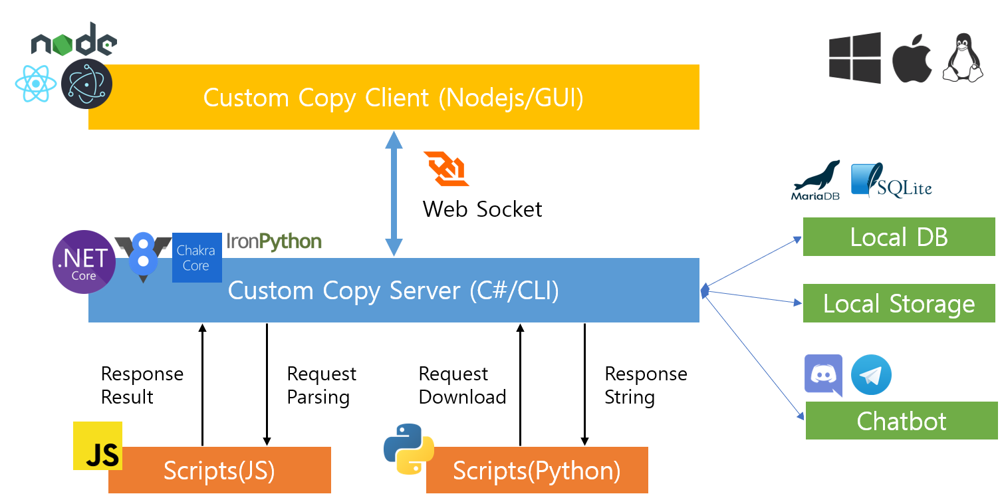

# Custom Copy Project

`Custom Copy` is a program that helps you extract texts, images and videos from many web sites, and manage downloaded contents.
This program supports Linux, Windows, and Mac OS X operating systems, and can be used for Server as well as User Level GUI Programs.

## Structure



frontend => nodejs(electronjs + reactjs)

backend => c# with javascript

C# is responsible for download, file management and communication with `frontend`.
Most things related to `crawling, processing, saving` will be implemented using javascript.

The `frontend` is just a User Level GUI tool for managing the `backend`.
You can also link with external networks through some settings.

## Make your own crawler using Custom Copy!!

`Custom Copy` provides a tool called `Custom Crawler` to implement crawler very easily.
Unfortunately, this tool is currently only supported on Windows.

### What is `Custom Crawler`?

`Custom Crawler` is `static` web analysis tools for Custom Copy Project.
With this tool, you can write crawlers many times more efficiently than using other browsers.

Currently, the `static` web analyzer is almost complete, and we are preparing to build a `dynamic` web analyzer.

## Libraries

```
CefSharp: https://github.com/cefsharp/CefSharp
ChromeDevTools: Origin https://github.com/MasterDevs/ChromeDevTools
                Fork   https://github.com/KevReed/ChromeDevTools
Costura: https://github.com/Fody/Costura
Discord.Net: https://github.com/discord-net/Discord.Net
Esprima: https://github.com/sebastienros/esprima-dotnet
HtmlAgilityPack: https://html-agility-pack.net/
JavaScriptEngineSwitcher: https://github.com/Taritsyn/JavaScriptEngineSwitcher
 - win10-x86 & win10-x64: V8
 - win10-arm & linux-x64 & osx.10.15-x64: ChakraCore
MaterialDesignThemes: https://github.com/MaterialDesignInXAML/MaterialDesignInXamlTool
MessagePack: https://github.com/neuecc/MessagePack-CSharp
Newtonsoft.Json: https://www.newtonsoft.com/json
libcef: https://github.com/chromiumembedded/cefkit
Selenium: https://github.com/SeleniumHQ/selenium
SixLabors.ImageSharp: https://github.com/SixLabors/ImageSharp
sqlte-net-pcl: https://github.com/praeclarum/sqlite-net
System.Net.Sockets: https://github.com/dotnet/corefx
System.Net.WebSockets: https://github.com/dotnet/corefx
Telegram.Bot: https://github.com/TelegramBots/Telegram.Bot
```
